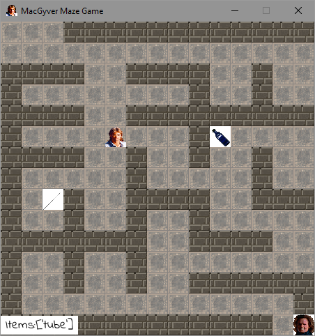

# macgyver-maze-game

**"Help macgyver to escape"**, game developed in Python3 and Pygame:

Game in which MacGyver is locked in a labyrinth. The exit is supervised by a guard. To distract, you need to combine the following elements: a needle, a plastic tube and ether. They will allow MacGyver to create a syringe and lull the guard to escape.

Control MacGyver with **&uparrow;** , &downarrow;, &leftarrow;, &rightarrow; and 'ESC' key to exit.



## Instructions

**Important:** Requires '`Python 3`' and '`pygame`' module.

First clone repository, in command prompt or terminal, enter this:

```console
git clone "https://github.com/vincenthouillon/macgyver-maze-game"
```

### For Windows

Open the command prompt in the folder you just cloned and enter this:

```console
python -m venv venv
python venv/Scripts/activate
pip install -r requirements.txt
macgyver-maze-game.py
```

#### Optional - Create an executable for Windows

If you want to create an executable:

```console
pip install cx_Freeze
```

And run:

```console
python setup.py build
```

In the '`build`' folder, you had to find the executable '`macgyver_maze_game.exe`'.

### For Linux

Open the terminal in the folder you just cloned and enter this:

```console
pip3 install venv
```

If doesn't work, type this:

```console
sudo apt-get install python-virtualenv
```

Then:

```console
source venv/bin/activate
pip3 install -r requirements.txt
python3 macgyver-maze-game.py
```

For disable the virtal environnement, enter:

```console
deactivate
```

***
> 2018 - OpenClassrooms - Project 03
