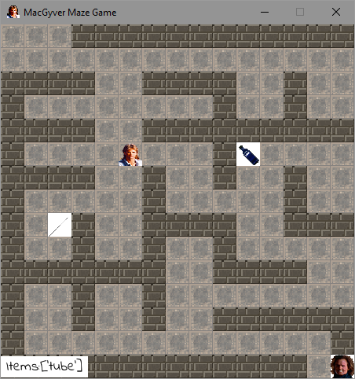

<meta name="author" content="Vincent Houillon">

# PROJET 03 : Aidez MacGyver s'échapper

<small>Vincent Houillon "Formation développeur d'application - Python"

**Code source :** <https://github.com/vincenthouillon/macgyver-maze-game>

</small>

---

## Introduction

<small>
Le projet consiste à développer un jeu de labyrinthe en 2D avec les fonctionnalités suivantes :

- un seul niveau, mais dont la structure doit être dans un fichier facilement modifiable;
- le personnage doit être contrôlé par les touches directionnelles du clavier;
- les objets doivent réparti aléatoirement dans le labyrinthe à chaque démarrage du jeu;
- le labyrinthe doit être un carré de 15x15 cases;
- les objets sont récupérés en passant dessus;
- le programme s'arrête quand on est face au gardien. Si on a tous les objets on gagne, sinon on perd.

**Attention :** Le programme doit être 'standalone' et codé uniquement en anglais et dans le respect des bonnes pratiques de la [PEP8](https://www.python.org/dev/peps/pep-0008/).

</small>

---

## Aperçu du jeu



---

## Arborescence du code

---
<small>

- En racine du projet on retouve les fichiers suivants :

    - **`'macgyver_maze_game.py'`** : _le programme principal_

    - **`'README.md'`** : _fiche de présentation du jeu notamment pour Github_

    - **`'requirements.txt'`** :  _pour installer les packages externes nécessaires au jeu_

    - **`'setup.py'`** : _script pour la création d'un exécutable pour Windows, voir `'README.md'`_

    - et un dossier **`'includes'`**

</small>

&#129091;

--

<small>
- Le dossier **`'includes'`** contient des éléments nécessaires pour le jeu :
  
    - `'classes.py'` : _génération du labyrinthe à partir du fichier et placement aléatoire des objets à collecter_

    - `'constants.py'` : _contient les paramètres du jeu_

    - `'labyrinth_scheme.txt'` : _fichier texte définissant la structure du labyrinthe_

    - `'macgyver.py'` : _gestion des déplacements de MacGyver_

    - et les dossiers `'font'` et un dossier `'img'` 

</small>
 
&#129091;

--

<small>
- Dossier **'font'** : _contenant :_

    - `IndieFlower.ttf` : _police utilisée dans je jeu pour la liste des objets et les messages de fin du jeu_

    - `OFF.txt` : _licence de la police d'écriture_

- Dossier **'img'** : _contenant les images utilisées du jeu  :_
    - `aiguille.png`
    - `ether.png`
    - `floor-tiles-20x20.png`
    - `Gardien.png`
    - `MacGyver.png`
    - `tube_plastique.png``etc.`

<small>(NB: Les images ont étés fournies avec le cahier des charges)</small>

</small>

---

## Fonctionnement du programme

---

<small>
Le fichier `'macgyver-maze-game.py'` appelle une méthode `'__generate'` de la classe `'Maze()'` du fichier '`classes.py'` pour lire le fichier `'labyrinth_scheme.txt'` et générer le labyrinthe:
</small>

```python
class Maze():
    ...
    def __generate(self):
        """Private method to generate the file-based labyrinth 
        and to randomly place objects there.
        """
        # Read the text file and generate the labyrinth
        try:
            with open(self.txt_file, "r") as f:
                # Read the file from line 12 to 26
                lines = f.readlines()[11:26]
                maze_structure = []
                for line in lines:
                    level_line = []
                    # We go through the sprites (letters) contained in the file
                    for sprite in line.strip("\n"):
                        # We add the sprite to the list of the line
                        level_line.append(sprite)
                    # Add the line to the level list
                    maze_structure.append(level_line)
        except FileNotFoundError:
    print("File not found or incorrect !!!")
```

&#129091;

--

<small>
Ensuite il place les objets aléatoirement dans le jeu en vérifiant que la disponibilité des cases :
</small>

```python
class Maze():
    def __generate(self):
        ...
        # Place the objects randomly
        loot = 0
        while loot < len(OBJECTS):
            x_object = randrange(0, SPRITE_NUMBER)
            y_object = randrange(0, SPRITE_NUMBER)

            if maze_structure[y_object][x_object] == " ":
                maze_structure[y_object][x_object] =
                    OBJECTS[loot]
                loot += 1

        self.structure = maze_structure
```

&#129091;

--

<small>
Toujours dans la classe 'Maze', nous retrouvons une méthode qui récupère la position
de MacGyver dans le fichier texte :
</small>

```python
class Maze():
    def __generate(self):
        ...
    def __get_position_mac(self):
            """Private method for get the macgyver position."""
            line_number = 0
            for line in self.structure:
                case_number = 0
                for sprite in line:
                    pos_x = case_number
                    pos_y = line_number
                    if sprite == "s":
                        self.macgyver_pos = (pos_x, pos_y)
                    case_number += 1
                line_number += 1
```

&#129091;

--
