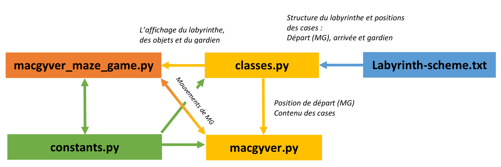

<meta name="author" content="Vincent Houillon">

**PROJET 03 : Aidez MacGyver s'échapper**
<small>

Vincent Houillon "Formation développeur d'application - Python"

**Code source :** <https://github.com/vincenthouillon/macgyver-maze-game>

<br>

<br><font size="+3">&nbsp;OPENCLASSROOMS - 2018&nbsp;</font>

</small>

---

Table des matières:

<small>

- [PROJET 03 :](#projet-03)
    - [Introduction](#introduction)
    - [Aperçu du jeu](#aper%C3%A7u-du-jeu)
    - [Arborescence du code](#arborescence-du-code)
    - [Fonctionnement du programme](#fonctionnement-du-programme)
    - [labyrinth-scheme.txt](#labyrinth-schemetxt)
    - [classes.py](#classespy)
    - [macgyver.py](#macgyverpy)
    - [constants.py](#constantspy)
    - [macgyver_maze_game.py](#macgyvermazegamepy)
- [Fin](#fin)

</small>

---

## Introduction
<small>
Le projet consiste à développer un jeu de labyrinthe en 2D avec les fonctionnalités suivantes :

- un seul niveau, mais dont la structure doit être dans un fichier facilement modifiable;
- le personnage doit être contrôlé par les touches directionnelles du clavier;
- les objets doivent être réparti aléatoirement dans le labyrinthe à chaque démarrage du jeu;
- le labyrinthe doit être un carré de 15x15 cases;
- les objets sont récupérés en passant simplement dessus;
- le programme s'arrête quand on est face au gardien. Si on a tous les objets on gagne, sinon on perd.

**Attention :** Le programme doit être 'standalone' et codé uniquement en anglais et dans le respect des bonnes pratiques de la [PEP8](https://www.python.org/dev/peps/pep-0008/).

</small>

---

## Aperçu du jeu


---

## Arborescence du code

---
<small>
<p style="text-align: left;">En racine du projet on retouve les fichiers suivants :</p>

- **`'macgyver_maze_game.py'`** : _le programme principal_

- **`'README.md'`** : _fiche de présentation du jeu notamment pour Github_

- **`'requirements.txt'`** :  _pour installer les packages externes nécessaires au jeu_

- **`'setup.py'`** : _script pour la création d'un exécutable pour Windows, voir `'README.md'`_

- et un dossier **`'includes'`**

</small>

<a href="#" class="navigate-down">&#129091;</a>

--

<small>
<p style="text-align: left;">Le dossier **`'includes'`** contient des éléments nécessaires pour le jeu :</p>
  
- `'classes.py'` : _génération du labyrinthe à partir du fichier et placement aléatoire des objets à collecter_

- `'constants.py'` : _contient les paramètres du jeu_

- `'labyrinth_scheme.txt'` : _fichier texte définissant la structure du labyrinthe_

- `'macgyver.py'` : _gestion des déplacements de MacGyver_

- et les dossiers `'font'` et `'img'`


</small>
 
<a href="#" class="navigate-down">&#129091;</a>

--

<small>
<p style="text-align: left;">Le sous-dossier **`'includes/font'`** contient :</p>

- `IndieFlower.ttf` : _police utilisée dans je jeu pour la liste des objets et les messages de fin du jeu_

- `OFF.txt` : _licence de la police d'écriture_

<p style="text-align: left;">Le sous-dossier **`'includes/img'`** contient les images utilisées du jeu  :</p>

- `aiguille.png`
- `ether.png`
- `floor-tiles-20x20.png` _(sprite contenant les murs et le sol du jeu)_
- `Gardien.png`
- `MacGyver.png`
- `tube_plastique.png`
- `etc.`

<small>(NB: Les images ont étés fournies avec le cahier des charges)</small>
</small>

---

## Fonctionnement du programme

---

Vue d'ensemble du fonctionnement du programme

<br>

---

## labyrinth-scheme.txt

<small>
C'est le fichier texte contenant la structure de départ du labyrinthe, la position initiale de Mac Gyver, du gardien et de la case qui déclenche la fin de la partie.
</small>

```text
MAZE 15x15 :
====
You can edit the maze here !

legend:
	w = wall
	  = floor
	s = start
	e = exit

---- START ----
s  wwwwwwwwwwww
               
wwww  wwww  w  
w        w  w  
wwww  wwwwwwwww
w        w     
wwww  w  w  w  
w     w     w  
w  w  wwww  www
w  w  w  w     
wwwwwww  wwww  
w  w  w        
w  w  w  wwwwww
w             w
wwwwwwwwwwwwweg
----- END -----

```

---

## classes.py

<small>
Le fichier `'Classes.py'` contient une classe `'Maze()'` avec une méthode `'__generate(self)'`
pour lire le fichier `'labyrinth_scheme.txt'` et générer le labyrinthe pour le programme principal `'macgyver_maze_game.py'`:
</small>

```python
class Maze():
    ...
    def __generate(self):
        """Private method to generate the file-based labyrinth 
        and to randomly place objects there.
        """
        # Read the text file and generate the labyrinth
        try:
            with open(self.txt_file, "r") as f:
                # Read the file from line 12 to 26
                lines = f.readlines()[11:26]
                maze_structure = []
                for line in lines:
                    level_line = []
                    # We go through the sprites (letters) contained in the file
                    for sprite in line.strip("\n"):
                        # We add the sprite to the list of the line
                        level_line.append(sprite)
                    # Add the line to the level list
                    maze_structure.append(level_line)
        except FileNotFoundError:
    print("File not found or incorrect !!!")
```

<a href="#" class="navigate-down">&#129091;</a>

--

<small>
Toujours dans la méthode `'__generate(self)'` les objets sont placés de façon aléatoire dans le labyrinthe en vérifiant que les cases sont bien des sols _(floor)_ :
</small>

```python
class Maze():
    def __generate(self):
        ...
        # Place the objects randomly
        loot = 0
        while loot < len(OBJECTS):
            x_object = randrange(0, SPRITE_NUMBER)
            y_object = randrange(0, SPRITE_NUMBER)

            if maze_structure[y_object][x_object] == " ":
                maze_structure[y_object][x_object] =
                    OBJECTS[loot]
                loot += 1

        self.structure = maze_structure
```

<a href="#" class="navigate-down">&#129091;</a>

--

<small>
Ensuite, nous trouvons toujours dans la classe `'Maze()'` une méthode qui récupère dans le fichier `'labyrinth_scheme.txt'` la position initiale de MacGyver :
</small>

```python
class Maze():
    def __generate(self):
        ...
    def __get_position_mac(self):
            """Private method for get the macgyver position."""
            line_number = 0
            for line in self.structure:
                case_number = 0
                for sprite in line:
                    pos_x = case_number
                    pos_y = line_number
                    if sprite == "s":
                        self.macgyver_pos = (pos_x, pos_y)
                    case_number += 1
                line_number += 1
```

<a href="#" class="navigate-down">&#129091;</a>

--

<small>
Et pour en finir avec la classe `'Maze()'`, nous trouvons une méthode `'display_maze(self, window)`' qui retourne l'affichage du labyrinthe pour pygame dans le programme principal.
</small>

```python
class Maze():
    ...
    def __generate(self):
        ...
    def __get_position_mac(self):
        ...
    def display_maze(self, window):
            """Initialize a window or screen for display in pygame.

            Arguments:
                window {object} -- window = pygame.display.set_mode(x, y)
            """
            DIM_SPRITE = (SPRITE_SIZE, SPRITE_SIZE)

            img_wall = pygame.image.load(IMG_SPRITES).convert()
            wall = pygame.transform.scale(
                img_wall.subsurface(300, 0, 20, 20), (DIM_SPRITE))

            img_floor = pygame.image.load(IMG_SPRITES).convert()
            floor = pygame.transform.scale(
                img_floor.subsurface(160, 40, 20, 20), (DIM_SPRITE))

            img_guardian = pygame.image.load(IMG_GUARDIAN).convert_alpha()
            guardian = pygame.transform.scale(img_guardian, (DIM_SPRITE))

            img_neddle = pygame.image.load(IMG_NEDDLE).convert_alpha()
            neddle = pygame.transform.scale(img_neddle, (DIM_SPRITE))

            img_tube = pygame.image.load(IMG_TUBE).convert_alpha()
            tube = pygame.transform.scale(img_tube, (DIM_SPRITE))

            img_ether = pygame.image.load(IMG_ETHER).convert_alpha()
            ether = pygame.transform.scale(img_ether, (DIM_SPRITE))

            line_number = 0
            for line in self.structure:
                case_number = 0
                for sprite in line:
                    pos_x = case_number * SPRITE_SIZE
                    pos_y = line_number * SPRITE_SIZE
                    if sprite == " " or sprite == "s":
                        window.blit(floor, (pos_x, pos_y))
                    elif sprite == "w":
                        window.blit(wall, (pos_x, pos_y))
                    elif sprite == "g":
                        window.blit(guardian, (pos_x, pos_y))
                    elif sprite == "e":
                        window.blit(floor, (pos_x, pos_y))
                    elif sprite == "neddle":
                        window.blit(neddle, (pos_x, pos_y))
                    elif sprite == "tube":
                        window.blit(tube, (pos_x, pos_y))
                    elif sprite == "ether":
                        window.blit(ether, (pos_x, pos_y))
                    case_number += 1
                line_number += 1
```

---

## macgyver.py

<small>
Le fichier `'macgyver.py'` contient une classe `'MacGyver()'` avec une méthode `'move(self, direction)'` pour gérer les déplacement du personnage. Il récupère la position de départ dans la classe `'Maze()'` et contrôle si les déplacements sont possibles en vérifiant les cases voisines _(murs et si toujours dans le labyrinthe)_ à Mac Gyver.
</small>

```python
class MacGyver:
    """MacGyver movement management."""

    def __init__(self, level):
        self.level = level

        # Initial position of MacGyver
        self.case_x, self.case_y = level.macgyver_pos
        self.x = self.case_x * SPRITE_SIZE
        self.y = self.case_y * SPRITE_SIZE

    def move(self, direction):
        """Move the character if there is no wall or if it does not 
        overflow the labyrinth.

        Arguments:
            direction {'str'} -- 'right', 'left', 'up', 'down'
        """
        if direction == "right":
            if self.case_x < SPRITE_NUMBER - 1:
                if self.level.structure[self.case_y][self.case_x + 1] != "w":
                    self.case_x += 1
                    self.x = self.case_x * SPRITE_SIZE

        if direction == "left":
            if self.case_x > 0:
                if self.level.structure[self.case_y][self.case_x - 1] != "w":
                    self.case_x -= 1
                    self.x = self.case_x * SPRITE_SIZE

        if direction == "up":
            if self.case_y > 0:
                if self.level.structure[self.case_y - 1][self.case_x] != "w":
                    self.case_y -= 1
                    self.y = self.case_y * SPRITE_SIZE

        if direction == "down":
            if self.case_y < SPRITE_NUMBER - 1:
                if self.level.structure[self.case_y + 1][self.case_x] != "w":
                    self.case_y += 1
                    self.y = self.case_y * SPRITE_SIZE

```

---

## constants.py

<small>
Le fichier `'constants.py'` contient toutes les constantes du jeu _(dimensions, liens vers les images, titre de la fenêtre, etc.)_. Il est utilisé par tous les autres fichiers.py.
</small>

```python
"""File content all constants for macgyver-maze-game."""

# Settings display
SPRITE_NUMBER = 15
SPRITE_SIZE = 30

WIDTH = HEIGHT = SPRITE_NUMBER * SPRITE_SIZE
DISPLAY_SIZE = (WIDTH, HEIGHT)

TITLE_WINDOW = "MacGyver Maze Game"
ICON_GAME = "includes/img/MacGyver.png"

IMG_SPRITES = "includes/img/floor-tiles-20x20.png"
IMG_MAC = "includes/img/MacGyver.png"
IMG_GUARDIAN = "includes/img/Gardien.png"

# Objects
OBJECTS = ["ether", "neddle", "tube"]
IMG_NEDDLE = "includes/img/aiguille.png"
IMG_TUBE = "includes/img/tube_plastique.png"
IMG_ETHER = "includes/img/ether.png"

# Colors
COLOR_BG = (255, 255, 255)
COLOR_FG = (0, 0, 0)

# Other files
FONT = ("includes/font/IndieFlower.ttf")
FILE_TEXT = ("includes/labyrinth_scheme.txt")

```

---

## macgyver_maze_game.py

<small>
C'est le programme principal, celui que l'on doit exécuter pour lancer le jeu. Il gère les touches du clavier, les événements _(quand le personnage est sur un objet ou la case devant le gardien)_, l'affichage du jeu et les messages de fin de partie.
</small>

```python
#! /usr/bin/env python3
# -*- coding: utf-8 -*-

"""Game in which MacGyver must pick up objects to lull a guardian to escape 
the maze.
"""

from time import sleep

import pygame

from includes.classes import Maze
from includes.constants import (COLOR_BG, COLOR_FG, DISPLAY_SIZE, FONT,
                                ICON_GAME, IMG_MAC, OBJECTS, SPRITE_SIZE,
                                TITLE_WINDOW)
from includes.macgyver import MacGyver

# Initialization
pygame.init()
clock = pygame.time.Clock()

# variables
icon = pygame.image.load(ICON_GAME)
screen = pygame.display.set_mode(DISPLAY_SIZE)
loop = True
items = []

# Various settings
pygame.display.set_caption(TITLE_WINDOW)
pygame.display.set_icon(icon)
screen.fill(COLOR_BG)
pygame.key.set_repeat(200, 300)

# Instantiations
level = Maze()
macgyver = MacGyver(level)

img_mac = pygame.transform.scale(pygame.image.load(
    IMG_MAC).convert_alpha(), (SPRITE_SIZE, SPRITE_SIZE))

# Text display settings
item_font = pygame.font.Font(FONT, 18)
list_items = item_font.render(" items:" + str(items) + " ",
                              True, (COLOR_FG), (COLOR_BG))


def gameover_msg(text):
    """To display the end-of-game message.

    Arguments:
        text {'str'} -- The message to display
    """
    gameover_background = pygame.Surface(screen.get_size())
    gameover_background.fill(COLOR_BG)
    screen.blit(gameover_background, (0, 0))
    # To display message
    gameover_font = pygame.font.Font(FONT, 48)
    game_over = gameover_font.render(
        text, True, (COLOR_FG), (COLOR_BG))
    # To center the text
    text_rect = game_over.get_rect()
    text_rect.centerx = screen.get_rect().centerx
    text_rect.centery = screen.get_rect().centery
    screen.blit(game_over, (text_rect))


while loop:
    for event in pygame.event.get():
        if event.type == pygame.QUIT or event.type == pygame.KEYDOWN and \
                event.key == pygame.K_ESCAPE:
            loop = False

        if event.type == pygame.KEYDOWN:
            if event.key == pygame.K_RIGHT:
                macgyver.move("right")
            elif event.key == pygame.K_LEFT:
                macgyver.move("left")
            if event.key == pygame.K_UP:
                macgyver.move("up")
            if event.key == pygame.K_DOWN:
                macgyver.move("down")

    level.display_maze(screen)
    screen.blit(img_mac, (macgyver.x, macgyver.y))
    screen.blit(list_items, (0, 422))
    pygame.display.flip()

    # region: Collision management
    if level.structure[macgyver.case_y][macgyver.case_x] == "neddle":
        level.structure[macgyver.case_y][macgyver.case_x] = " "
        items.append("neddle")
        list_items = item_font.render(
            " Items:" + str(items) + " ", True, (COLOR_FG), (COLOR_BG))

    if level.structure[macgyver.case_y][macgyver.case_x] == "ether":
        level.structure[macgyver.case_y][macgyver.case_x] = " "
        items.append("ether")
        list_items = item_font.render(
            " Items:" + str(items)+" ", True, (COLOR_FG), (COLOR_BG))

    if level.structure[macgyver.case_y][macgyver.case_x] == "tube":
        level.structure[macgyver.case_y][macgyver.case_x] = " "
        items.append("tube")
        list_items = item_font.render(
            " Items:" + str(items) + " ", True, (COLOR_FG), (COLOR_BG))

    if level.structure[macgyver.case_y][macgyver.case_x] == "e":
        if len(items) == len(OBJECTS):
            gameover_msg("You have won !!!")
            pygame.display.flip()
            sleep(2)
            loop = False
            pygame.quit()
        else:
            gameover_msg("Sorry, you lost :(")
            pygame.display.flip()
            sleep(2)
            loop = False
            pygame.quit()
    # endregion
```

---

# Fin

<small>
Le jeu `'macgyver-maze-game'` a été réalisé sous `'Python 3.6.4'` utilisant les modules suivants:

- Pygame 1.9.4
- venv _(inclus dans Python)_
- time.sleep
- random.randint
- cx-Freeze 5.1.1

Environnement de développement :

- Visual Studio Code
- Windows 10
- Linux Mint 18

Présentation réalisée avec `'vscode-reveal 2.0.3'`.
</small>
